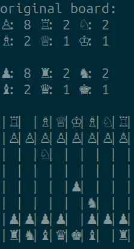

# Cagnus Marlsen

> **A cutting-edge chess engine built with precision, creativity, and great professionalism by Emilie Kristensen, Peter Dogan, Eiken Chang, and Eugenio Animali.**

Cagnus Marlsen is a high-performance chess engine inspired by the legendary Magnus Carlsen. Designed to provide thrilling gameplay and analytical depth, this engine combines efficient bitboard-based computations with beautiful board rendering for an unparalleled chess experience.

---

## 🖼️ _A thrilling visual experience_

 | 

---

## 🤝 Contributors

Meet the team behind Cagnus Marlsen:

- **Eiken**: Project Lead and Core Architect
- **Peter**: AI Specialist
- **Emilie**: Rendering Wizard
- **Eugenio**: Algorithm Guru

Their combined expertise ensures that every move Cagnus Marlsen makes is a masterpiece.

---

## 📜 License

**Copyright 2025 by Peter Dogan and Contributors.**

This software is released under the **MIT License**, a distinguished and widely recognized license within the open-source community. By adopting this license, we acknowledge the incredible contributions of developers worldwide while promoting a culture of sharing and collaboration. For detailed terms, refer to the LICENSE file.

_"MIT License: fueling innovation without boundaries."_

---

## 🌟 Acknowledgments

We couldn’t have done it without:

- **Magnus Carlsen**: For lending his name and the chess genius aura that inspired us to dream big.
- **Eduroam**: For only occasionally disconnecting us during key moments of development.
- **Chess**: The game of kings, queens, and a million wasted productivity hours, without which this project would never exist.

---

## 🚀 Features

- **Lightning-Fast Computation**: Leverages bitboard representation for ultra-efficient move generation and board evaluation.
- **Elegant Rendering**: Experience chess like never before with our **beautiful board rendering**.
- **Human and AI Matchups**: Engage in matches against other players or pit AIs against each other.
- **Modular and Extensible**: Ready for advanced features like opening books, endgame tablebases, and more.

---

## 🧠 How It Works

### Bitboard Representation
At the heart of Cagnus Marlsen is its **bitboard architecture**, which encodes the state of the chessboard into a 64-bit unsigned integer (`uint64_t`). Each bit represents a square, enabling:

- **Blazing Move Generation**: Compute moves with optimized bitwise operations.
- **Compact Memory Footprint**: Efficiently store and process board states.

### Interactive mode

For the coders out there, change the `src/main.cpp` file and use the line `play_me(argv[2], argv[4])` to play against the bot in real time.

### AI Logic
The chess engine incorporates:

- **Move Validation**: Ensures legality of all moves according to FIDE rules.
- **Position Evaluation**: Assigns scores to board states for optimal decision-making.
- **Future Expansion**: Planned implementations of minimax, alpha-beta pruning, and advanced heuristics.

---

## 🎮 Getting Started

### Prerequisites

- C++ Compiler (e.g., GCC, Clang)
- CMake

### Installation

1. Clone the repository:
   ```bash
   git clone https://gitlab.binets.fr/yung-hsuan.chang/cagnus
   ```
2. Navigate to the project directory:
   ```bash
   cd cagnus
   ```
3. Build the project:
   ```bash
   cmake .
   make
   ```

### Running the Engine

Run the engine in your terminal:
```bash
./cagnus -H io_files/history.csv -o io_files/output.csv
```

---

## 🛠️ Development

### Code Structure

- **src/**: Core implementation files.
- **h_files/**: Header files for modular design.
- **tools.cpp**: Utilities for board rendering and bitboard manipulation.
- **board.cpp**: Main logic for board state management.

### Contribution

We welcome contributions! To contribute:

1. Fork the repository.
2. Create a feature branch:
   ```bash
   git checkout -b feature-name
   ```
3. Commit your changes:
   ```bash
   git commit -m "Add new feature"
   ```
4. Push to your branch:
   ```bash
   git push origin feature-name
   ```
5. Open a Pull Request.


