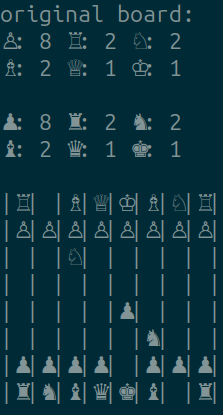
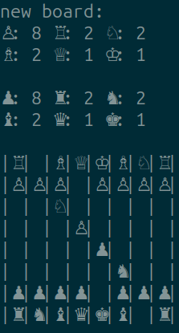

# Chessbot Project From Scratch

> **A cutting-edge chess engine built with precision, creativity, and great professionalism by Eugenio Animali, Emilie Kristensen, Peter Dogan and Eiken Chang.**

Designed to provide thrilling gameplay and analytical depth, this engine combines efficient bitboard-based computations with beautiful board rendering for an unparalleled chess experience.

---

## 🖼️ _A thrilling visual experience_

 | 

---

## 🎮 Try it out

### Prerequisites

- C++ Compiler (e.g., GCC, Clang)
- CMake

### Installation

1. Clone the repository and go to build subdirectory:
   ```bash
   git clone https://github.com/jetzypetz/chess_bot
   cd chess_bot/build
   ```
2. Build the project:
   ```bash
   cmake .
   make
   ```
3. Run immediately:
   ```bash
   ./bot.exe
   ```

---

## 🤝 Contributors

Meet the team behind Cagnus Marlsen:

- **Eugenio**: Project Lead and Machine Architect
- **Peter**: AI Specialist
- **Emilie**: Rendering Wizard
- **Eiken**: Algorithm Guru

---

## 🌟 Acknowledgments

We couldn’t have done it without:

- **Magnus Carlsen**: For lending his chess genius aura that inspired us to dream big.
- **Eduroam**: For only occasionally disconnecting us during key moments of development.
- **English Tea**: without which this project would never exist.

---

## 🚀 Features

- **Lightning-Fast Computation**: Leverages bitboard representation for ultra-efficient move generation and board evaluation.
- **Elegant Rendering**: Experience chess like never before with our **beautiful board rendering**.
- **Human and AI Matchups**: Engage in matches against other players or pit AIs against each other.
- **Modular and Extensible**: Ready for advanced features like opening books, endgame tablebases, and more.

---

## 🧠 How It Works

### Bitboard Representation
At the heart of Cagnus Marlsen is its **bitboard architecture**, which encodes the state of the chessboard into a 64-bit unsigned integer (`uint64_t`). Each bit represents a square, enabling:

- **Blazing Move Generation**: Compute moves with optimized bitwise operations.
- **Compact Memory Footprint**: Efficiently store and process board states.

### Interactive mode

The bot is set up to play interactively in real time as default. Can you beat the bot?

### AI Logic
The chess engine incorporates:

- **Move Validation**: Ensures legality of all moves according to FIDE rules.
- **Position Evaluation**: Assigns scores to board states for optimal decision-making.
- **Future Expansion**: Planned implementations of minimax, alpha-beta pruning, and advanced heuristics.

---

## 🛠️ Development

### Code Structure

- **src/**: Core implementation files.
- **h_files/**: Header files for modular design.
- **tools.cpp**: Utilities for board rendering and bitboard manipulation.
- **board.cpp**: Main logic for board state management.
